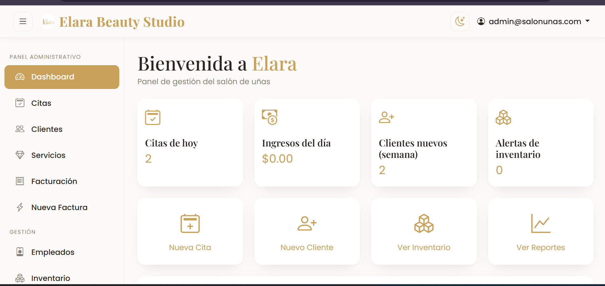
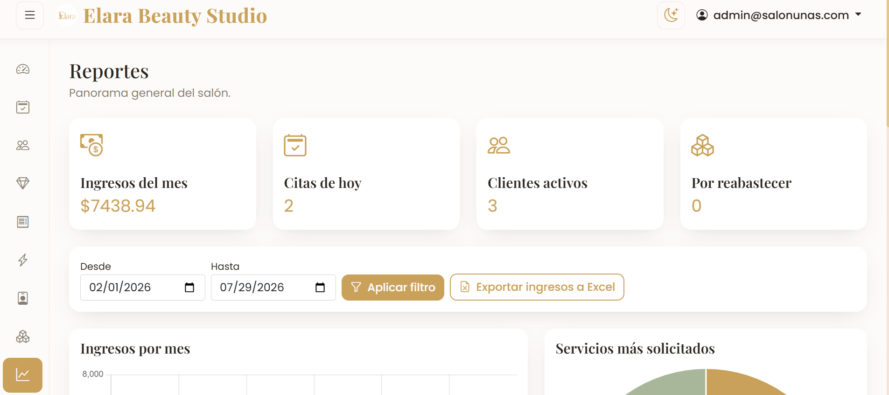
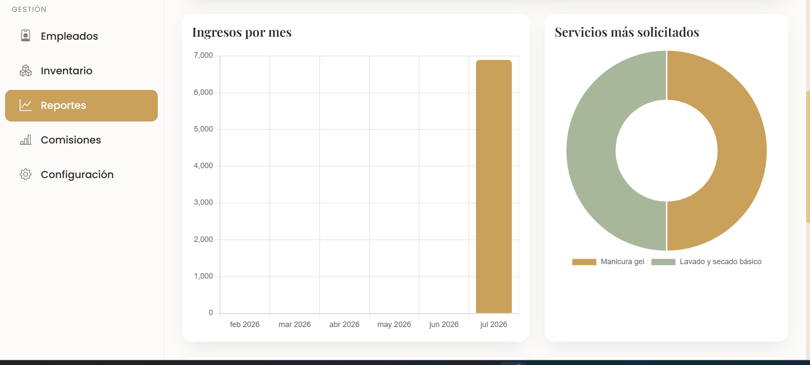
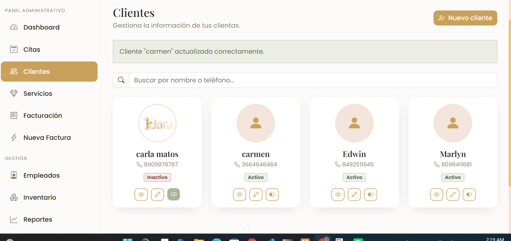
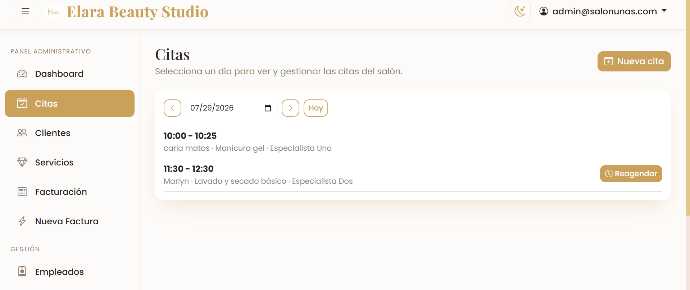
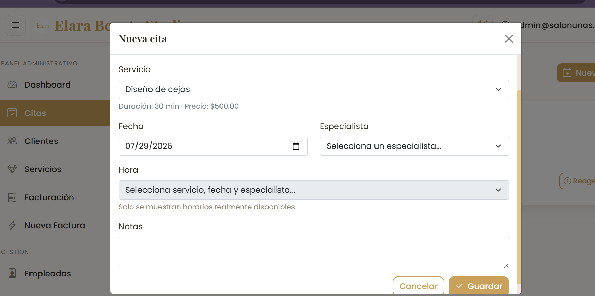
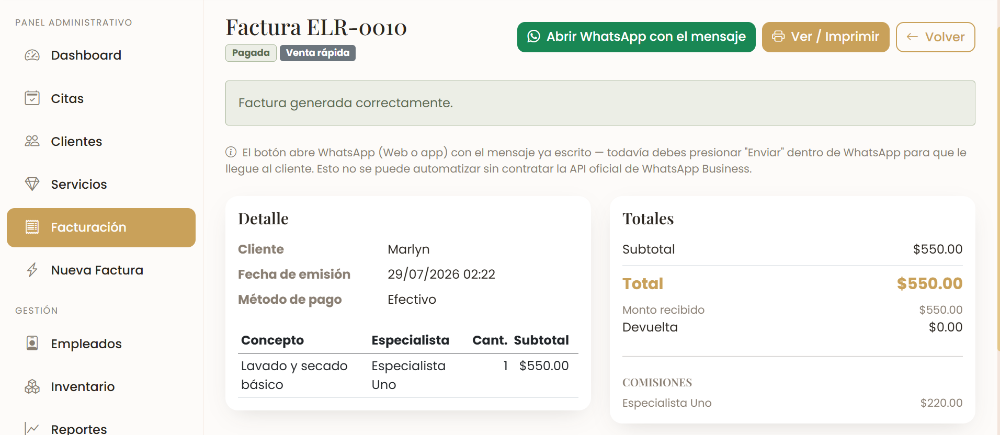

<div align="center">
  

  # Elara Beauty Studio

  **Sistema completo de gestión para salones de belleza** — citas, facturación, inventario, personal y reportes, construido con ASP.NET Core MVC.

  [](https://dotnet.microsoft.com/)
  [](https://learn.microsoft.com/dotnet/csharp/)
  [](https://www.mysql.com/)
  [](https://getbootstrap.com/)
  [](LICENSE)

  [English](README.md) · **Español**
</div>

---

## Descripción general

Elara es una aplicación web pensada para la operación diaria de un salón de belleza real: agendar citas según el horario de cada especialista, cerrar la venta con una factura detallada, controlar el inventario de productos, y darle al dueño del negocio una imagen clara de sus ingresos y comisiones — todo detrás de accesos diferenciados por rol para **Administrador**, **Recepcionista** y **Especialista**.

Es una app ASP.NET Core MVC renderizada del lado del servidor, a propósito: sin framework de SPA ni proceso de build para el frontend — vistas Razor, un poco de JavaScript puro para las interacciones con AJAX, y un sistema de diseño propio en lugar del Bootstrap por defecto. La meta era una app rápida y con pocas dependencias, que un negocio pequeño pueda correr sin complicaciones en un servidor modesto.

## Capturas de pantalla

<table>
  <tr>
    <td width="50%"><br/><sub align="center">Inicio de sesión</sub></td>
    <td width="50%"><br/><sub align="center">Dashboard</sub></td>
  </tr>
  <tr>
    <td width="50%" colspan="2" align="center">
      <br/>
      <br/>
      <sub align="center">Reportes — KPIs, ingresos y servicios top</sub>
    </td>
  </tr>
  <tr>
    <td width="50%"><br/><sub align="center">Catálogo de servicios</sub></td>
    <td width="50%"><br/><sub align="center">Directorio de clientes</sub></td>
  </tr>
  <tr>
    <td width="50%"><br/><sub align="center">Citas — listado por día</sub></td>
    <td width="50%"><br/><sub align="center">Nueva cita — disponibilidad en tiempo real</sub></td>
  </tr>
  <tr>
    <td width="50%" colspan="2" align="center"><br/><sub align="center">Factura con envío por WhatsApp</sub></td>
  </tr>
</table>

## Funcionalidades

**Citas**
- Listado de citas día por día (con navegador de fecha, sin depender de una librería de calendario externa), con creación, edición, reagendado y flujo de estados (`Pendiente → Confirmada → En proceso → Completada`, además de `Cancelada` / `No asistió`).
- Disponibilidad en tiempo real: al elegir servicio, fecha y especialista, solo se muestran los horarios realmente libres, calculados a partir del horario laboral semanal de cada especialista y sus citas ya existentes.
- Cada especialista tiene su propia **Agenda** de solo lectura — las citas de su día y cambios de estado con un clic.

**Facturación**
- Cierre de venta desde una cita completada, o **Venta Rápida** independiente para clientes/productos sin cita previa.
- Facturas con líneas de detalle (servicios y/o productos), descuentos con justificación obligatoria, métodos de pago (efectivo/tarjeta/transferencia) con carga de comprobante para transferencias.
- Reporte de caja diario y reporte de comisiones por empleado, ambos con filtro de rango de fechas.
- **Envío por WhatsApp** con un clic — arma un enlace `wa.me` con un mensaje formateado y detallado, sin necesidad de contratar la API de pago de WhatsApp Business.
- Devoluciones parciales o totales por línea, reflejadas automáticamente en el inventario.

**Clientes, servicios e inventario**
- Directorio de clientes con historial de visitas.
- Catálogo de servicios con categorías, duración y precio (la duración determina el tamaño del bloque de horario de la cita).
- Inventario de productos con niveles de stock, historial de movimientos y alertas de stock bajo.

**Personal**
- Perfiles de empleados vinculados 1 a 1 con una cuenta de acceso, horarios laborales semanales, especialidades, y un porcentaje de comisión que calcula automáticamente lo que gana cada empleado por cada venta o servicio.
- Contraseña temporal al crear la cuenta, con cambio de contraseña obligatorio en el primer inicio de sesión.

**Reportes**
- Ingresos por mes, servicios más solicitados, ranking de empleados, clientes nuevos por mes — todo en gráficas interactivas con Chart.js y filtro de rango de fechas.
- Exportación a Excel (vía ClosedXML) de los datos de ingresos.

**Plataforma**
- ASP.NET Core Identity con tres roles (`Administrador`, `Recepcionista`, `Especialista`) — rutas, menús y acciones se adaptan según el rol de quien inició sesión.
- Tema claro/oscuro, resuelto del lado del servidor (sin parpadeo del tema incorrecto al cargar) y guardado por usuario.
- Logging estructurado con Serilog (consola + archivo diario).
- Perfil del negocio configurable (nombre, logo, horario, moneda) desde el panel de administración.

## Stack tecnológico

| Capa | Elección |
|---|---|
| Framework | ASP.NET Core MVC (.NET 8) |
| Base de datos | MySQL / MariaDB vía Entity Framework Core + [Pomelo.EntityFrameworkCore.MySql](https://github.com/PomeloFoundation/Pomelo.EntityFrameworkCore.MySql) |
| Autenticación | ASP.NET Core Identity, autorización basada en roles |
| Frontend | Vistas Razor, Bootstrap 5, JavaScript puro (`fetch`), Chart.js |
| Logging | Serilog (consola + archivo) |
| Exportación de reportes | ClosedXML |
| Arquitectura | Controllers → Services (reglas de negocio) → Repositories (EF Core) → SQL, con ViewModels en el límite entre controlador y vista |

### Un par de decisiones técnicas que vale la pena mencionar

- **Motor de disponibilidad**: en vez de permitir choques de horario y luego resolverlos, `DisponibilidadService` calcula las franjas horarias candidatas directamente desde el `HorarioTrabajo` de cada empleado (horario laboral por día de la semana) y las cruza contra las citas ya existentes — la interfaz solo puede ofrecer horarios que estén realmente libres.
- **Sin librería de calendario**: una versión anterior usaba FullCalendar; se reemplazó por un listado renderizado en el servidor con pequeños modales por AJAX. Menos vistoso, considerablemente más robusto — no hay estado de calendario en el cliente que pueda desincronizarse del servidor.
- **WhatsApp sin contratar una API**: la comunicación con clientes usa enlaces "click to chat" de `wa.me` con un mensaje pre-cargado y con marca propia, en lugar de la API paga de WhatsApp Business Cloud — una decisión deliberada para un negocio pequeño que no necesita envío programático, no quiere pagar una mensualidad por eso, y aun así obtiene un resultado cuidado.

## Roles y permisos

| | Administrador | Recepcionista | Especialista |
|---|:---:|:---:|:---:|
| Dashboard y reportes | ✅ | – | – |
| Citas (crear/editar/reagendar) | ✅ | ✅ | – |
| Mi agenda (citas propias, solo lectura) | – | – | ✅ |
| Clientes y servicios | ✅ | ✅ | – |
| Facturación | ✅ | ✅ | – |
| Empleados, inventario, comisiones, configuración | ✅ | – | – |

## Cómo ejecutarlo

### Requisitos

- [.NET 8 SDK](https://dotnet.microsoft.com/download)
- Servidor MySQL o MariaDB corriendo localmente (o accesible)

### Configuración

```bash
git clone https://github.com/Luzmy555/Elara.git
cd Elara/Elara

# Configurar la conexión a la base de datos (user-secrets la mantiene fuera del control de versiones)
dotnet user-secrets init
dotnet user-secrets set "ConnectionStrings:DefaultConnection" "Server=127.0.0.1;Port=3306;Database=elara_db;User=root;Password=;"

# Aplicar las migraciones (crea la base de datos) y sembrar el usuario administrador inicial
dotnet ef database update

# Ejecutar
dotnet watch run
```

La app queda disponible en `http://localhost:5291`. En el primer arranque, `SeedData` crea los roles `Administrador`, `Recepcionista` y `Especialista`, y una cuenta de administrador por defecto — revisa `Data/SeedData.cs` para ver las credenciales sembradas.

## Estructura del proyecto

```
Elara/
├── Controllers/        # Un controlador por módulo (Citas, Facturas, Empleados, Reportes, ...)
├── Services/            # Reglas de negocio (motor de disponibilidad, facturación, comisiones, ...)
├── Repositories/        # Acceso a datos con EF Core, uno por agregado
├── Models/              # Entidades de EF Core
├── ViewModels/          # Formas adaptadas a cada vista/formulario
├── Views/               # Vistas Razor, agrupadas por controlador
├── wwwroot/             # CSS (sistema de diseño propio), JS, archivos estáticos
└── Data/                # DbContext y datos semilla
```

## Licencia

Publicado bajo la [Licencia MIT](LICENSE).
